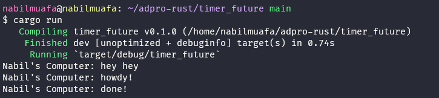
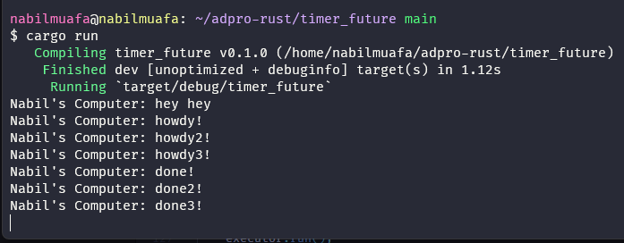

# Tutorial 10.1 Reflection Notes

## 1.2 Understanding How It Works

Pada pemrograman secara asikronus, instruksi tidak dijalankan secara sekuential/berurutan. Dalam hal ini, fungsi `main()` awalnya membuat executor dan spawner terlebih dahulu, kemudian memanggil spawn pada spawner secara asinkronus untuk mem-spawn sebuah thread terpisah yang bisa mengeksekusi instruksi yang diberikan pada spawner. Karena instruksi baru diberikan ke spawner dan belum ada instruksi untuk mengeksekusinya, maka instruksi belum dijalankan. Kemudian `main()` menerima instruksi mencetak "hey hey" dan menjalankannya lebih dulu. Barulah di akhir `main()`, executor untuk thread yang sudah di spawn tadi dijalankan dan "howdy!" serta "done!" dicetak. Itulah mengapa urutannya justru "hey hey" paling dulu.

## 1.3 Multiple Spawn and removing drop

Pada kasus ini, diberikan pemanggilan spawner sebanyak 3 kali, sehingga ada seolah 3 thread berbeda untuk masing-masing menjalankan task yang akan diberikan kepadanya. Untuk masalah urutan dengan pesan "hey hey", kurang lebih sama seperti penjelasan di poin sebelumnya. Pada kedua kasus (gambar pertama dan kedua), urutan pencetakan akan selalu dimulai dari howdy1, howdy2, howdy3, begitupun dengan done1, done2, done3 karena hal tersebut menyesuaikan dengan urutan bagaimana spawner dipanggil. Meski begitu, ketiga task dilakukan secara paralel tanpa menunggu task lainnya selesai. Selain itu, `drop(spawner)` berfungsi untuk memberi tahu executor bahwa setelah semua spawn sebelumnya, tidak akan ada lagi spawner yang dipanggil sehingga executor tahu tidak akan ada task tambahan lagi. Makanya setelah `drop(spawner)` dihapuskan, program masih berlanjut karena executor berekspektasi bahwa masih akan ada task lain yang diberikan. Beda kasusnya dengan yang menggunakan `drop(spawner)`, setelah eksekusi selesai program juga langsung selesai.
